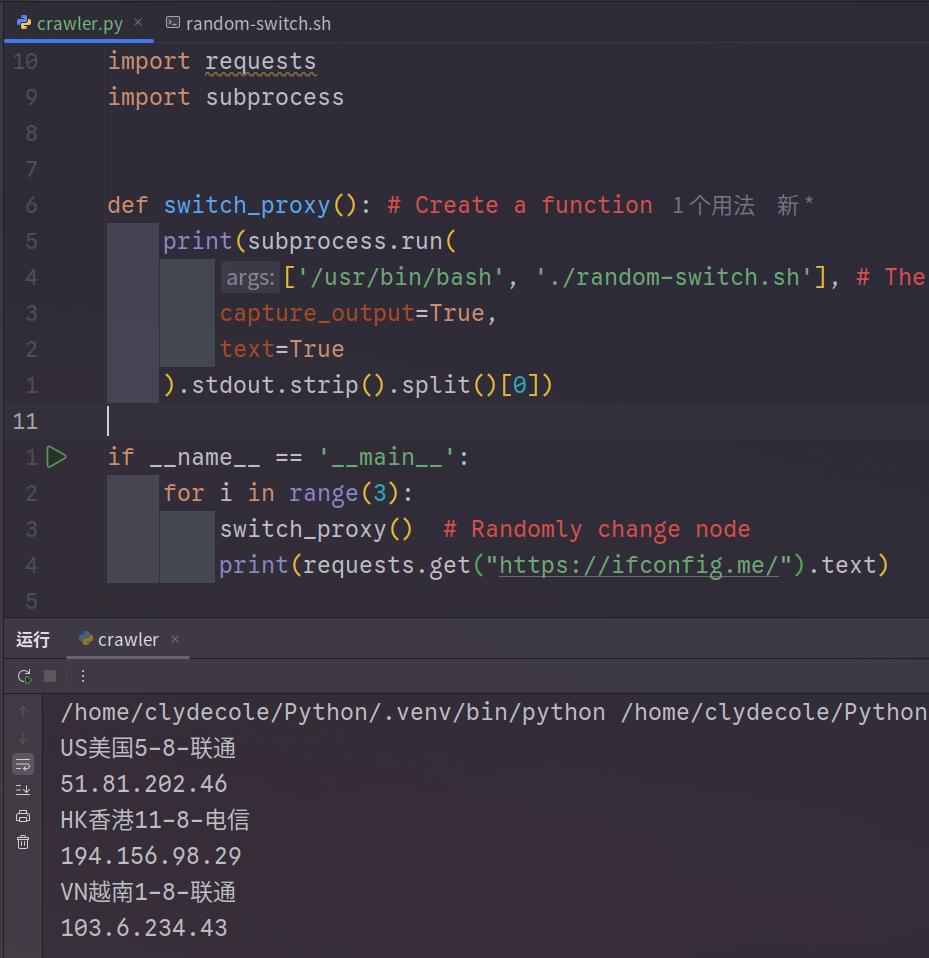

# clash-auto-proxy-crawler

此文檔提供

- [English Document](README.md)
- [中文文檔](README-CN.md)

## 關於專案

使用這個專案，你可以在Python 爬蟲中接入**Clash Verge** 的代理，並實現自動隨機切換。

## 如何使用

- 第一步，下載jq工具

```bash
sudo pacman -S jq # Arch Linux
sudo apt install jq # Debian/Ubuntu
```

- 第二步，請編輯 `random-switch.sh` 檔案中的 **Configurations** 設定。
  - 若你不確定 **Configurations** 如何填寫，請參考 [clash-setting.md](clash-setting.md) 文件。

- 接著，請在你的爬蟲程式中加入此函式。

```python 
import subprocess
def switch_proxy():
	subprocess.run(
		['/usr/bin/bash', './random-switch.sh'],
		capture_output=True,
		text=True
	)

# 如果你需要輸出提示可以使用: 
def switch_proxy():
	print(subprocess.run(
	...
	).stdout)
# 會在每次執行函數時輸出切換到哪一個節點
```

- 即可在程式內直接透過該函式進行節點切換。

```python
if __name__ == '__main__':
	for i in range(3):
		switch_proxy()
		print(requests.get("https://ifconfig.me/").text)
```

- 執行效果

  

## 注意事項

- 在使用此函式前，請先將Clash Verge 的節點切換至 **GROUP_NAME** 所設定的代理組。  
這是**必要步驟**，否則函式將無法正常切換節點。

- 該專案由於使用的shell腳本來切換節點，因此暫時僅適用於Linux
   - MacOS使用者需要自行修改部分代碼

- 需要下載jq 工具，否者無法執行shell代碼


### LICENSE

[MIT License](LICENSE)

###  參與貢獻 與 幫助

- 提交 Bug 回報或功能建議
- 發送 Pull Request
- 協助改進文件
- 分享給更多使用者

每一份 Issue、Pull Request 或 Bug 回報，  
都是對我極大的幫助與支持，感謝你的參與與貢獻！

如果這個專案對你有幫助，別忘了給個 ⭐️ 支持一下！  
這會是我繼續維護的動力