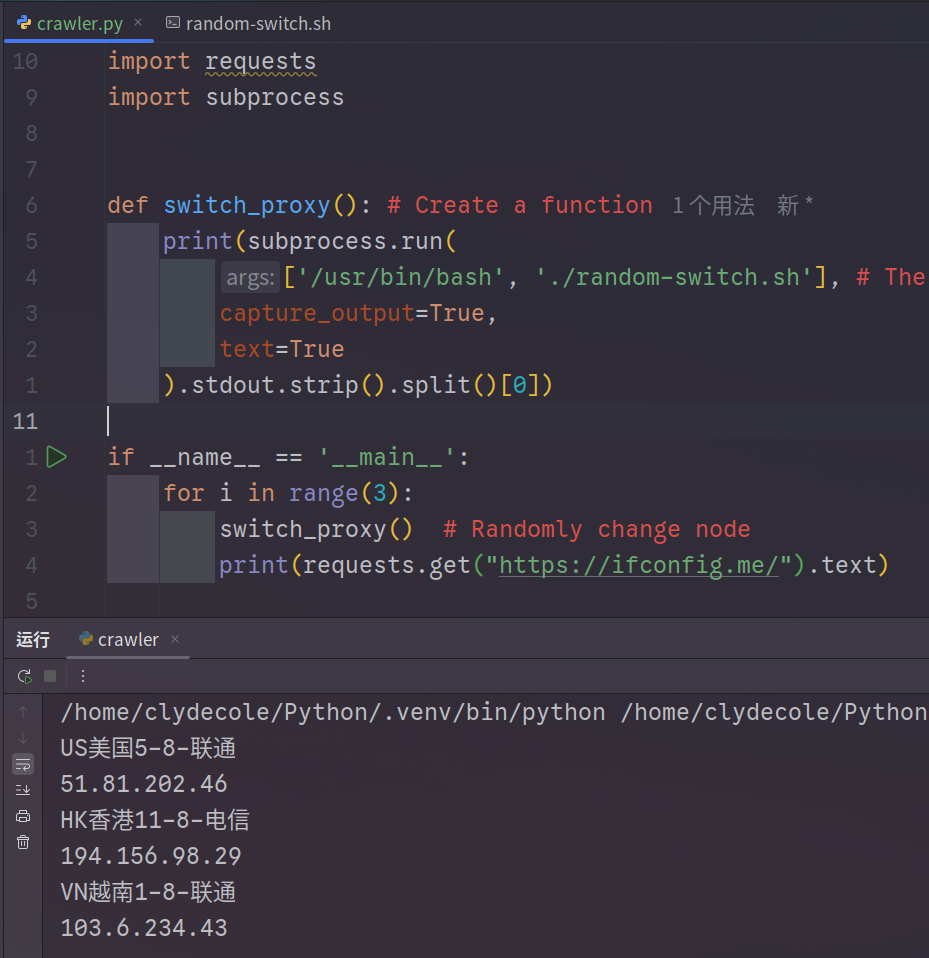

# clash-auto-proxy-crawler

This document provides

- [English Document](README.md)
- [中文文檔](README-CN.md)

## About the Project

This project allows you to integrate **Clash Verge**'s proxy into your Python crawler, enabling automatic and random proxy switching.

## How to Use

**Step 1:** Install the `jq` tool.

```bash
sudo pacman -S jq      # Arch Linux
sudo apt install jq    # Debian / Ubuntu
```

**Step 2:** Edit the **Configurations** section in the `random-switch.sh` file.

- If you're not sure how to fill in the **Configurations**, please refer to [clash-setting.md](clash-setting-EN.md).

**Step 3:** Add the following function to your crawler:

```python
import subprocess

def switch_proxy():
    subprocess.run(
        ['/usr/bin/bash', './random-switch.sh'],
        capture_output=True,
        text=True
    )

# If you want to print the output:
def switch_proxy():
    print(subprocess.run(
        ['/usr/bin/bash', './random-switch.sh'],
        capture_output=True,
        text=True
    ).stdout)
# Each time the function runs, it prints the node that was switched to.
```

Now you can directly call this function in your program to switch nodes:

```python
if __name__ == '__main__':
    for i in range(3):
        switch_proxy()
        print(requests.get("https://ifconfig.me/").text)
```

### Execution Example



------

## Notes

- Before using this function, make sure to switch the **Clash Verge** proxy group to the one specified by **GROUP_NAME**.  
This step is **required**, otherwise the function won't switch nodes properly.
- This project uses a shell script to switch nodes, so it currently supports **Linux** only.  
macOS users will need to make some code adjustments.
- Ensure `jq` is installed, otherwise the shell script will not work.

------

## License

[MIT License](LICENSE)

------

## Contributing & Support

- Submit bug reports or feature suggestions
- Send pull requests
- Help improve the documentation
- Share it with more users

Every issue, pull request, or bug report means a lot to me —
your contribution and support help keep this project alive

If you find this project helpful, please give it a ⭐️ —
it really motivates me to keep maintaining it!