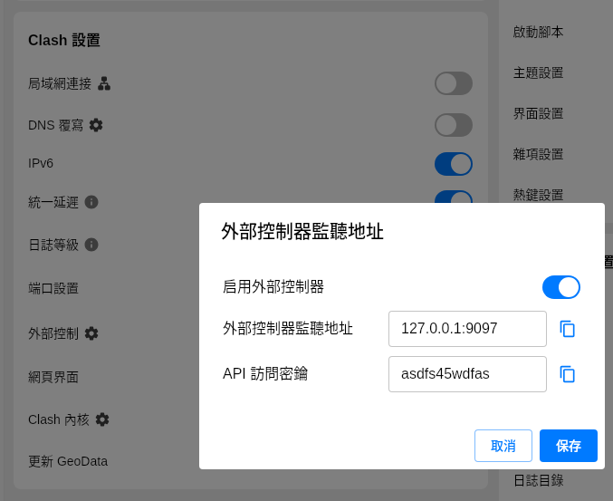
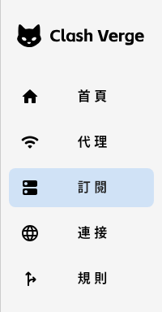
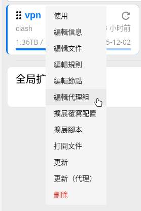
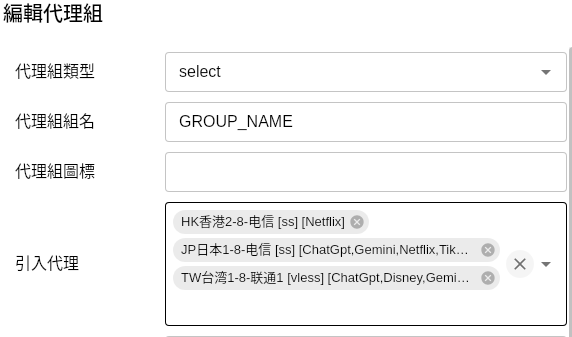
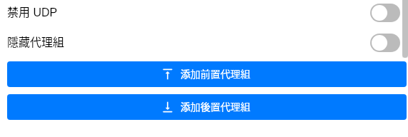
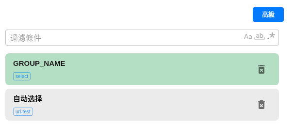
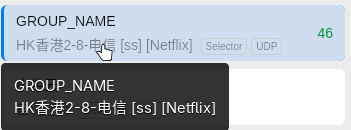

# 如何在clash verge找到random-switch的Configurations設定

## `ADDRESS` 和 `API_KEY` 的填寫

- clash verge 設定 => 外部控制 => 外部控制器監聽地址

---

## `GROUP_NAME` 的填寫:

1. 打開你的clash verge 的訂閱

2. 找到你的訂閱 => 右鍵 => **編輯代理組**

- **組類型**: 選擇 `select`
- **代理組組名**就是: `Configurations` 的 `GROUP_NAME`
- **引入代理**: 選擇你要隨機的VPN 節點

3. 其他設定保持默認狀，點擊**添加前置代理組**

4. 添加前置代理組後應當會在右側最頂部出現，然後點擊右下角保存

5. 回到代理，選擇剛剛添加的代理組

- 將 `代理組名` 填寫到 `Configurations` 的 `GROUP_NAME` 就可以了