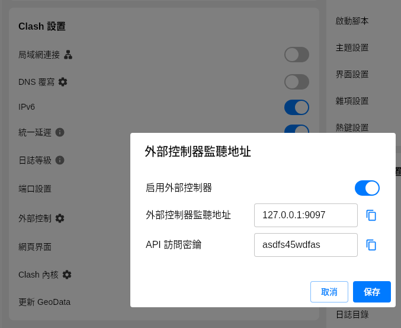
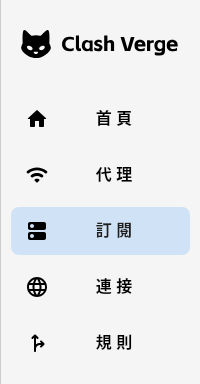

# How to Locate the Configurations Settings of random-switch in Clash Verge

## Filling in `ADDRESS` and `API_KEY`

- In Clash Verge, go to Settings => External => External Controller

Use this address to fill in the `ADDRESS` and `API_KEY` fields in your `random-switch` configuration.

---

## Filling in `GROUP_NAME`

1. Open your Clash Verge Profiles.

2. Locate your subscription => right-click => **Edit Proxy Groups**

- **Group Type:** choose `select`
- **Group Name:** this is the value for `GROUP_NAME` in the `Configurations` section
- **Use Proxies:** select the VPN nodes you want to switch randomly

3. Keep other settings as default, then click **PREPEND GROUP**

4. After adding the PREPEND GROUP, it should appear at the lower right corner. Then click **SAVE**.

5. Go back to proxies and select the newly added proxy group.

- Fill the `proxy group name` into the `GROUP_NAME` field in the `Configurations`.